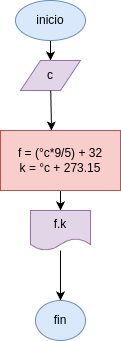

# convertir_en_temperatura
programar en python para comvertir grados centigrados a grados fahrenhait.kelvin

## analisis

### variable de entrada 
- c: temperatura

### procedimiento
- f= (c*9/5) + 32
- k= C + 273.15

## diseño

